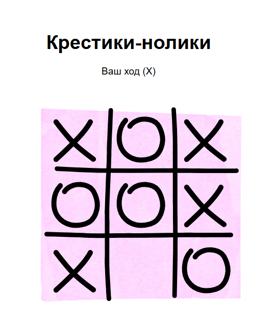

# Игра Крестики-нолики

Простая и увлекательная реализация классической игры "Крестики-нолики" на React с анимациями и интуитивно понятным интерфейсом.



## Особенности

-  Анимированные крестики и нолики
-  Адаптивный дизайн
-  Логика ИИ для компьютера

## Установка и запуск

1. Клонируйте репозиторий:

```bash
    git clone https://github.com/julllikkk/tic-tac-toe.git
```

2. Перейдите в папку проекта:

```bash
    cd путь/до/твоего/проекта
```

3. Установите зависимости:

```bash
    npm install
```

4. Запустите игру:

```bash
    npm run dev
```
Игра будет доступна по адресу: http://localhost:3000


## Как играть

1. Игрок всегда ходит первым (крестиками)
2. Компьютер автоматически делает ход ноликами
3. Цель - собрать линию из 3 своих крестиков
4. При победе/поражении/ничье появится модальное окно
5. Нажмите "Играть снова" для рестарта


## Технологии
- React
- Vite
- TypeScript
- Lottie для анимаций
- CSS